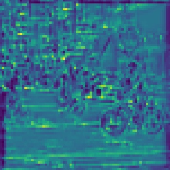

[TOC]

# 环境

pytorch 1.7

loguru 0.5.3

NVIDIA 1650 4G

intel i5-9th

torch-pruning 0.2.7

------

# 安装包

```
pip install torch_pruning
```

Note:本项目是在b站up主**Bubbliiiing**和原YOLOX官方代码进行了整合。

1.添加了feature可视化功能

2.训练中可开启EMA功能

3.网络剪枝(支持s,m,l,x)

3.1支持单个卷积剪枝

3.2支持网络层剪枝

4.剪枝后微调训练

5.Conv与BN层的融合推理加速

6.保存log信息

**数据集格式：采用voc数据集格式**


------

# feature视化

在tools/Net_Vision.py为可视化代码实现。可以通过在网络层导入NV函数，实现通道可视化。

eg:

```python
features = [out_features[f] for f in self.in_features]
[x2, x1, x0] = features  # shape is (batch_size,channels,w,h)
NV(x2)
```


<p align="center">
  
</p>

# 网络剪枝

参考论文：**Pruning Filters for Efficient ConvNets**

导入剪枝工具

```
import torch_pruning as tp
```

如果需要看yolov4的，可以看：https://blog.csdn.net/z240626191s/article/details/124326595

采用通道剪枝，而不是权重剪枝。

在剪枝之前需要通过tools/prunmodel.py  save_whole_model(weights_path, num_classes) 函数将模型的权重和结构都保存下来。

weights_path:权重路径

num_classes：自己类别数量

```
model = YOLOX(num_classes, 's')  # 这里需要根据自己的类数量修改  s指yolox-s
```

**支持对某个卷积的剪枝**：调用**Conv_pruning(whole_model_weights):**

```
pruning_idxs = strategy(v, amount=0.4)  # 0.4是剪枝率 根据需要自己修改，数越大剪的越多
```

对于单独一个卷积的剪枝，需要修改两个地方值，**这里的卷积层需要打印模型获得，不要自己盲目瞎猜**：

```
if k == 'backbone.backbone.dark2.0.conv.weight'
```

```
pruning_plan = DG.get_pruning_plan((model.backbone.backbone.dark2)[0].conv, tp.prune_conv, idxs=pruning_idxs)
```

支持网络层的剪枝：调用**layer_pruning(whole_model_weights):**

```python
included_layers = list((model.backbone.backbone.dark2.modules()))  # 针对某层剪枝
```


**Note:**剪枝成功以后，会打印模型的参数变化量！如果没有打印，说明你剪的不对，好好检查一下！

剪枝以后的log日志文件会保存在logs文件下

# 剪枝后的微调训练

将train.py中的**pruned_train**设置为**True**.

**False**为正常训练，然后自己修改**batch_size**。

注意修改**model_path**和**classes_path**，不然会报错！

剪枝前的网络输入大小和微调训练以及推理时的大小必须一致！

# 训练自己的数据集

如果你有用过**Bubbliiiing** up主的代码，你将很快就能上手。数据集采用的是VOC的形式

```
VOCdevkit/
`-- VOC2007
    |-- Annotations  (存放xml标签文件)
    |-- ImageSets
    |   `-- Main
    `-- JPEGImages (存放图像)

```

在model_data中新建一个new_classes.txt，里面写入自己的类。运行voc_annotation.py，会在当前目录生成2007_train.txt文件和2007_val.txt文件。(可以检查一下里面有没有生成成功)

在train.py中，将classes_path修改为model_data/new_classes.txt【等预测的时候，也是需要在yolo.py中修改这里】

然后根据需要修改其他超参即可训练，训练权重会保存在logs文件中(默认保存权值，不含网络结构)

# 预测

**参数说明：**下面终端的输入都是可选的

--predict:预测模式

--pruned:开启剪枝预测或训练

--image:图像检测

--video:开始视频检测

--video_path:视频路径

--camid:摄像头id 默认0

--fps:FPS测试

--dir_predict:对一个文件夹下图像进行预测

--phi:可以选择s,m,l,x等

--input_shape:网络输入大小，默认640

--confidence:置信度阈值

--nms_iou:iou阈值

--num_classes:类别数量，默认80

--fuse:是否开启卷积层和BN层融合加速，默认False

终端输入：

```
# 图像预测
python demo.py --predict --image
```

```shell
# 视频预测
python demo.py --predict --video --camdi 0
```

```shell
# fps测试
python demo.py --predict --fps
```

默认预测都为yolox_s，如果要指定其他网络，输入：(需要注意的是在yolo.py修改权重路径，如果是自己数据集，还需要修改classes_path)

```
# 使用yolox_l预测
python demo.py --predict --image --phi l
```

# Conv与BN层的融合推理加速

其他命令可以搭配使用，比如采用conv和bn融合的方式进行推理

```shell
python demo.py --predict --image --fuse
```

通过测试发现FPS提升了3帧/s左右(我的GPU是1650)

# 日志文件的保存

本项目采用loguru工具捕获日志，检测和训练中的一些日志记录会自动记录，保存在logs文件下，一个log文件的大小我设置的上限大小为1 MB，如果超过该范围，会自动生成一个新的.log文件，可以自己修改这个值，或者修改日志保存时间(以免保存了太多的日志)。如果不想要这个功能，可以找到相应的位置注释掉即可。


这里只是帮助大家造轮子，用尽可能简单的代码实现一些功能，不用大家再去看复杂的工程代码，最终的效果需要自己耐心调试，慢慢“炼丹”！

# 权重

链接：https://pan.baidu.com/s/1Jbq8dCv893rZ7RkaANUZgQ 
提取码：yypn
